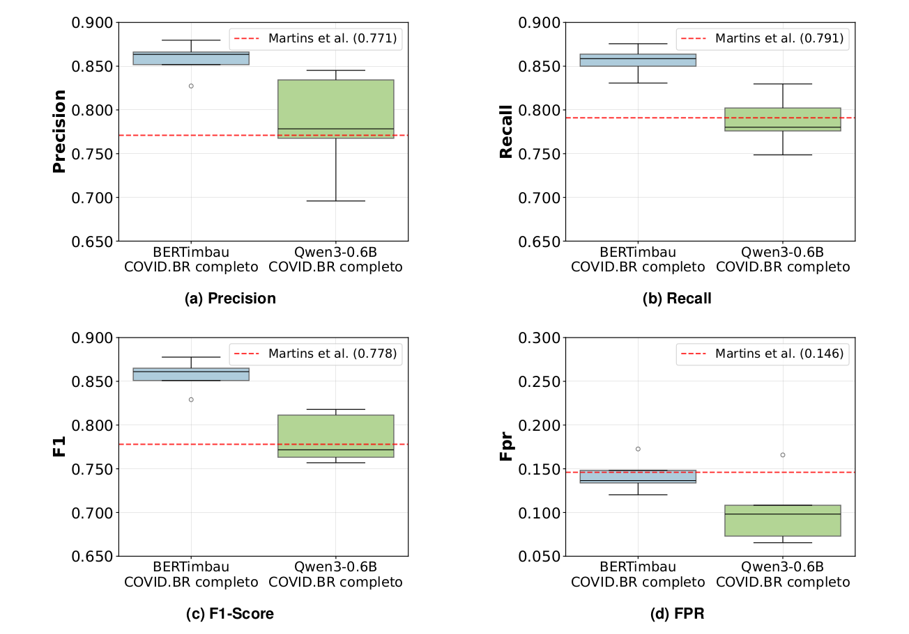

# Fine-tuned COVID.BR Misinformation Sequence Classifiers on Language Models

Giulia Chimini Stefainski¹ , Leonardo Azzi Martins¹ , Matheus de Moraes Costa¹

*¹ Instituto de Informática – Universidade Federal do Rio Grande do Sul (UFRGS)*

*{giulia.stefainski, lamartins, matheus.costa}@inf.ufrgs.br*

---

*Abstract: The spread of misinformation about COVID-19 on platforms like WhatsApp represents a significant challenge. This work investigates and compares the effectiveness of two language model approaches for misinformation detection in Brazilian Portuguese: one based on Natural Language Understanding (NLU) and another on Natural Language Generation (NLG). Therefore fine-tuning experiments were conducted with the BERTimbau (NLU) and Qwen3-0.6B (NLG) models, and their performance was compared with that of traditional machine learning models. While BERTimbau outperformed previous approaches with an F1 score of 0.857, Qwen showed weaker performance at 0.787, only slightly above the original SVM baseline of 0.778.*

*Resumo: A disseminação de desinformação sobre a COVID-19 em plataformas como o WhatsApp representa um desafio significativo. Este trabalho investiga e compara a eficácia de duas abordagens de modelos de linguagem para a tarefa de detecção de desinformação em português brasileiro: uma baseada em compreensão de linguagem natural (NLU) e outra em geração (NLG). Para isso, foram realizados experimentos de fine-tuning com os modelos BERTimbau (NLU) e Qwen3-0.6B (NLG), além de comparar com modelos tradicionais de aprendizado de máquina. Enquanto o BERTimbau superou abordagens anteriores com uma pontuação F1 de 0.857, o Qwen apresentou desempenho inferior, com 0.787, apenas ligeiramente acima do baseline original do SVM, de 0.778.*

Based on [COVID19.BR: A Dataset of Misinformation about COVID-19 in Brazilian Portuguese WhatsApp Messages](https://zenodo.org/records/5193932) [Martins et al. (2021)].

# Setup

- Create a virtual environment
  
    `python3 -m venv env`

- Activate the virtual environment

    `source env/bin/activate`

- Install the requirements
    `pip install -r requirements.txt`

---

> UNIVERSIDADE FEDERAL DO RIO GRANDE DO SUL - INSTITUTO DE INFORMÁTICA
> 
> INF01221 - PROCESSAMENTO DE LINGUAGEM NATURAL (2025/1)
> 
> PROF. Dennis Giovani Balreira